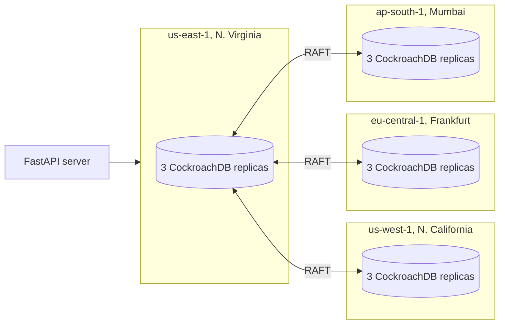

# Geo-Distributed Ride-Sharing Backend

A ride-sharing backend that keeps serving riders and drivers when a server, a zone or an entire AWS region goes down. Data is partitioned by region so most reads stay local, and CockroachDB's RAFT consensus handles failover.

Built for the Distributed Database Systems course at Arizona State University (Oct to Dec 2025).

**Demo video:** https://www.youtube.com/watch?v=qZhQthkY2vI

> **Attribution:** This was a team project. My contributions: [FILL IN, e.g. cluster topology and Docker Swarm deployment, region-aware partitioning, fault-injection testing, benchmarks].

## Results

Measured on the cloud deployment across four AWS regions with 340K+ records.

| Metric | Result |
| --- | --- |
| Throughput | 540 TPS |
| Local (in-region) reads | 4 ms |
| Cross-region writes | 113 ms |
| Failover time | ~3 seconds |
| Fault scenarios tested | 50+, including full region and zone outages |

## Architecture

12 CockroachDB nodes: three replicas per host, on four Ubuntu EC2 instances, one in each AWS region. Docker Swarm connects the hosts over an overlay network, and each node is labeled with its region so the database knows where it physically sits.



- **Region-aware partitioning:** rides and users live in the region they belong to, so reads are served locally.
- **Replication:** synchronous within a region, asynchronous across regions.
- **Failover:** RAFT elects a new leader when a node or region drops, with no manual intervention.

**Tech stack:** Python, FastAPI, CockroachDB, MongoDB, Docker, Docker Swarm, AWS EC2 (Ubuntu)

## Run locally

1. Create and activate a virtual environment, then install dependencies:

   ```bash
   python -m venv venv
   source venv/bin/activate        # Windows: venv\Scripts\activate
   pip install -r requirements.txt
   ```

2. Start the FastAPI server. The API runs at http://localhost:8000.

   ```bash
   fastapi dev server/main.py
   ```

3. Start the CockroachDB containers and initialize the cluster (once):

   ```bash
   docker-compose up -d
   docker exec -it roach-east-1 ./cockroach init --insecure
   ```

   The CockroachDB dashboard is at http://localhost:8080.

4. Create the database and assign regions (see [Create the database and regions](#create-the-database-and-regions)).

> The `--insecure` flag disables TLS and authentication. It keeps local setup simple and should not be used for a real deployment.

## Environment configuration

Copy the sample file and set `ENVIRONMENT` to `local` or `cloud`:

```bash
cp .env.sample .env
```

For the cloud environment, also set:

```
ENVIRONMENT=cloud
US_EAST_HOST=your-us-east-host.com
US_EAST_PORT=26257
US_WEST_HOST=your-us-west-host.com
US_WEST_PORT=26257
EU_CENTRAL_HOST=your-eu-central-host.com
EU_CENTRAL_PORT=26257
AP_SOUTH_HOST=your-ap-south-host.com
AP_SOUTH_PORT=26257
DATABASE_NAME=rideshare
DB_USER=your_username
DB_PASSWORD=your_password
```

Load the variables with `python-dotenv`, or export them manually:

```bash
export $(cat .env | xargs)
```

On Windows PowerShell:

```powershell
Get-Content .env | ForEach-Object { if ($_ -match '^([^=]+)=(.*)$') { [Environment]::SetEnvironmentVariable($matches[1], $matches[2], 'Process') } }
```

## Generate and load data

```bash
python data_generation.py              # cloud: hundreds of thousands of rows per region; local: a small test set
python load_generated_data.py          # load
python load_generated_data.py --clear  # delete and reload
python load_generated_data.py --delete-only
```

## Run on AWS

### 1. Launch EC2 instances

Launch one Ubuntu EC2 instance in each region: `us-east-1`, `us-west-1`, `eu-central-1`, `ap-south-1`. On each one, install Docker:

```bash
sudo apt-get update
sudo apt-get install -y docker.io
sudo usermod -aG docker $USER
```

Open these ports in each security group, allowing inbound traffic from the other instances' private IPs:

| Port | Purpose |
| --- | --- |
| 2377 | Docker Swarm management |
| 7946 | Docker Swarm node communication |
| 4789 | Docker Swarm overlay network |
| 26257 | CockroachDB |
| 8080 | CockroachDB Admin UI |
| 22 | SSH |

### 2. Set up Docker Swarm

On the `us-east-1` instance:

```bash
docker swarm init --advertise-addr <PUBLIC_IP_NODE_1>
```

On the other three instances, run the join command it prints:

```bash
docker swarm join --token <YOUR_TOKEN> --advertise-addr <PUBLIC_IP_NODE_N> <PUBLIC_IP_NODE_1>:2377
```

Check that all four nodes joined with `docker node ls`, then label each node with its region:

```bash
docker node update --label-add region=us-east <NODE-1-ID>
docker node update --label-add region=us-west <NODE-2-ID>
docker node update --label-add region=eu-central <NODE-3-ID>
docker node update --label-add region=ap-south <NODE-4-ID>
```

### 3. Deploy the stack

```bash
docker stack deploy -c docker-stack.yml rideshare
docker stack ps rideshare
```

Initialize the cluster from the `roach-east-1` container:

```bash
docker ps | grep roach-east-1
docker exec -it <CONTAINER_ID> ./cockroach init --insecure
```

## Create the database and regions

Open a SQL shell in the `roach-east-1` container (`docker exec -it <CONTAINER_ID> ./cockroach sql --insecure`). Multi-region features need a CockroachDB enterprise license.

```sql
SET CLUSTER SETTING enterprise.license = 'YOUR-CRDB-KEY-HERE';

CREATE DATABASE rideshare;
ALTER DATABASE rideshare PRIMARY REGION "us-east";
ALTER DATABASE rideshare ADD REGION "us-west";
ALTER DATABASE rideshare ADD REGION "eu-central";
ALTER DATABASE rideshare ADD REGION "ap-south";

SHOW REGIONS FROM DATABASE rideshare;
```
